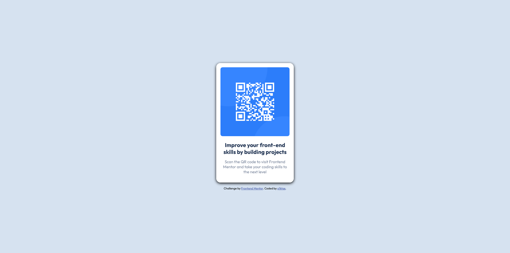

# Frontend Mentor - QR code component solution

This is a solution to the [QR code component challenge on Frontend Mentor](https://www.frontendmentor.io/challenges/qr-code-component-iux_sIO_H). Frontend Mentor challenges help you improve your coding skills by building realistic projects. 

## Table of contents

- [Overview](#overview)
  - [Screenshot](#screenshot)
  - [Links](#links)
- [My process](#my-process)
  - [Built with](#built-with)
  - [What I learned](#what-i-learned)
  - [Continued development](#continued-development)
  - [Useful resources](#useful-resources)
- [Author](#author)
- [Acknowledgments](#acknowledgments)

## Overview

### Screenshot




### Links

- Solution URL: [Link to Git repo](https://github.com/p1ktas/qr-code)
- Live Site URL: [Link to a live site](https://p1ktas-qr.netlify.app/)

## My process

I approached this project with few things on my mind - to get better at understanding layouts, to apply my theoretical Flexbox knowledge and to test myself, to see, how much I learned in one month of grinding OdinProject's front-end dev course in my free time. At first, I've analysed design pictures and tried to identify how many flex containers there are and how many flex items there are. Then, I've realised it's only a one flex container, that contains an image, a heading and a paragraph. As soon as I started laying code onto html and .css files, I've realised how little I actually understood the Flexbox, even though, I thought it was very simple and straight forward tool to use theoretically. After few hours of frustration, I've had a pretty rough looking website, without any alignment and everything all over the place. Texted my friend, who works as a front-end dev, and started explaining to him, how I approached everything and what should do what, and as I was venting about my problems, suddenly, the solution to this challenge hit me like a train and I started spamming the actual solution to him. He didn't even have time to reply to me, all he did, was drop me wiki link to an article about "Rubber duck debugging" [Rubber duck debugging](https://en.wikipedia.org/wiki/Rubber_duck_debugging) (Read it, it actually REALLY helps). After all of that struggle, it was pretty simple, made a flex container, put some flex items into it, applied font weights and sizes, added some gaps and padding and it was all done and just to spicy it up a little, added a box-shadow.

### Built with

- Semantic HTML5 markup
- CSS
- Flexbox

### What I learned

I learned a quite lot doing this simple and small project, I don't even know where to start! Learned more about flexbox and it's uses, learned how to setup a flex container, how to add flex-items, learned how style them, align them. I also learned how to make variables, how to center a container in the middle of the page, how to import a font, how padding, margins and borders work and so on!


```css
Proud of learning this simple stuff:
:root {
    --white: hsl(0, 0%, 100%);
    --gray: hsl(212, 45%, 89%);
    --g-blue: hsl(220, 15%, 55%);
    --blue: hsl(218, 44%, 22%);

}
```


### Continued development

I would probably like to add an actual QR code generator at some point in the future, really keen to start learning javascript.

### Useful resources

- [FLEXBOXFROGGY](https://flexboxfroggy.com/) - This helped me a lot to get a better grasp of flexbox.
- [Rubber duck debugging](https://en.wikipedia.org/wiki/Rubber_duck_debugging) - This is an amazing article and everyone should read it, amazing concept and it really works.
- [CSS Tricks](https://css-tricks.com/almanac/) - This helped me to find some CSS commands I've forgotten about.
- [TheOdinProject](https://www.theodinproject.com/) - If you want to start your front-end journey, and don't know where to - this is one of the best places to do so, also it's FREE!
- [Kevin Powell](https://www.youtube.com/@KevinPowell) - This guy is an insane inspiration to me, his videos are very well made and I've actually learned about variables, by watching his videos.

## Author

- My Github - [Github](https://github.com/p1ktas/qr-code)
- Frontend Mentor profile - [@p1ktas](https://www.frontendmentor.io/profile/p1ktas)


## Acknowledgments

- My loving and supporting girlfriend;
- My good friend Domantas, who listens all day, everyday about my struggles learning how to code and gives me great tips!;
- All the good guys and gals of the internet, that answer newbie questions, no matter how stupid they are.

